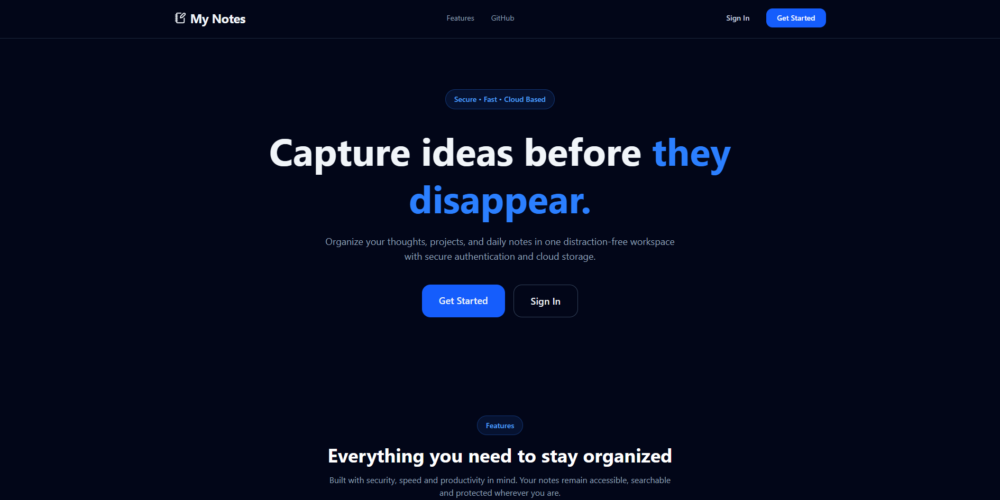
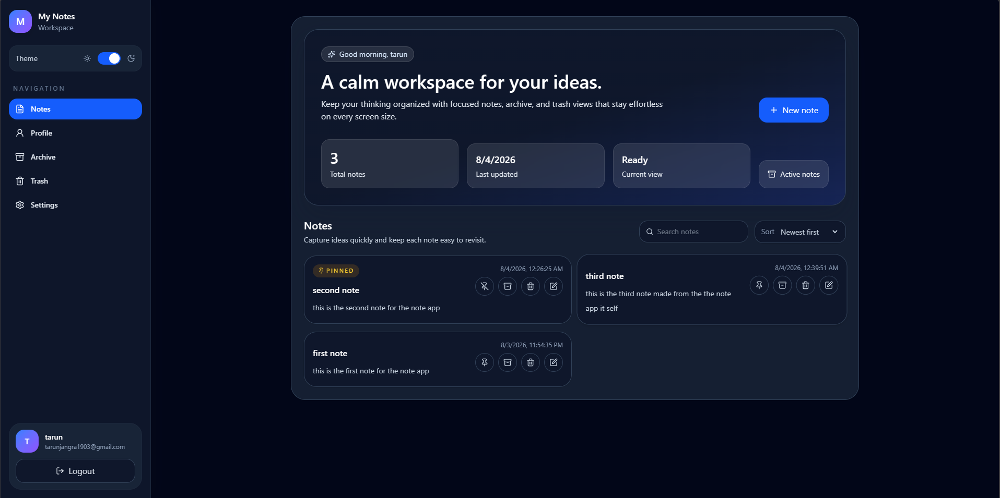
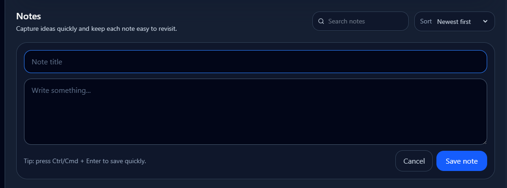
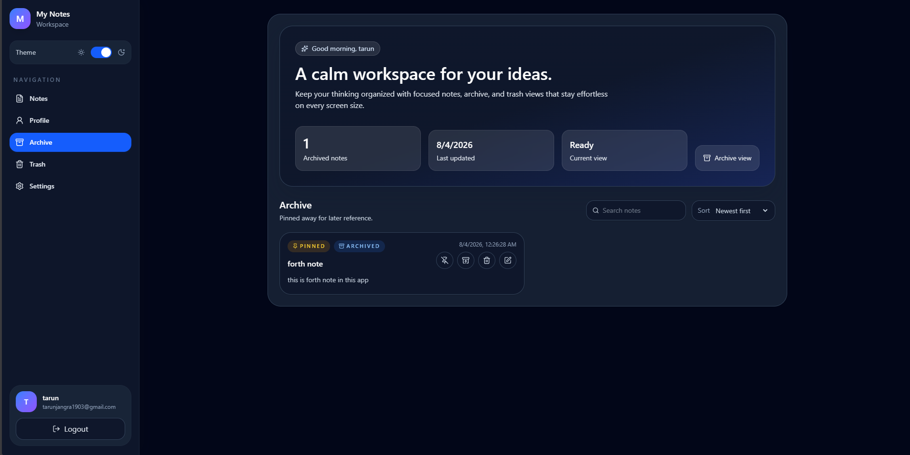
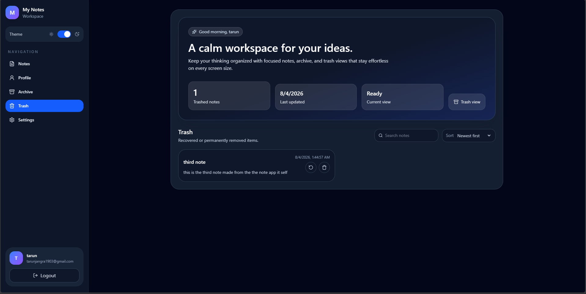
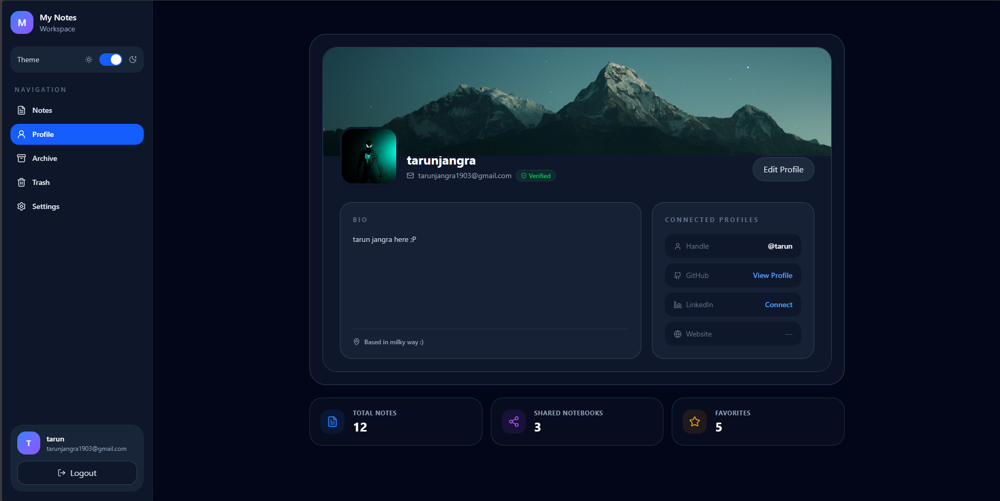
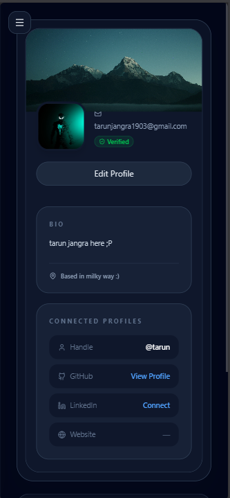
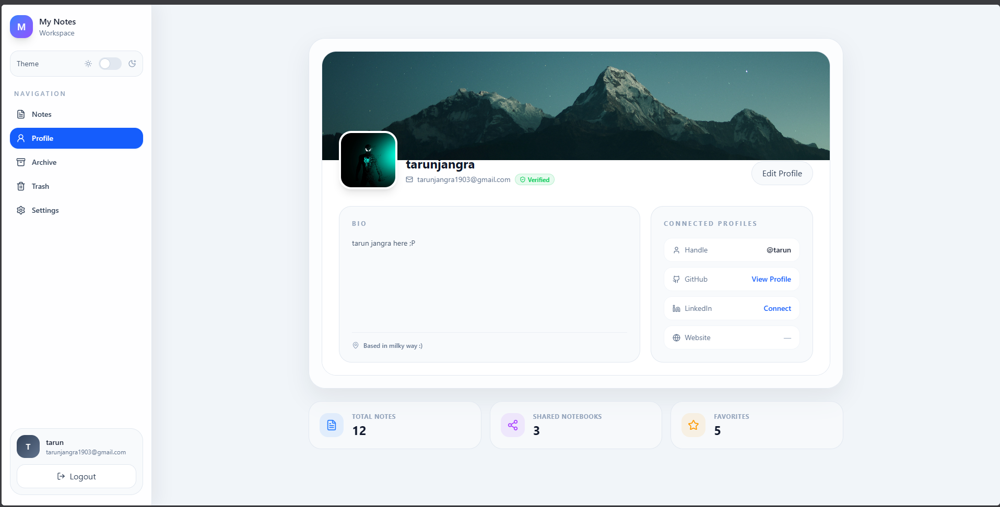

# 📝 Scribe

A modern full-stack cloud note-taking application built using the MERN stack. It provides secure authentication, cloud-based note management, search, pagination, archive, trash, and password recovery while maintaining a clean and responsive user experience.

---

## ✨ Features

### 🔐 Authentication

- User Registration
- User Login
- Secure Logout
- JWT Authentication
- Refresh Token Rotation
- Protected Routes
- Forgot Password
- Password Reset via Email
- Secure Password Hashing using bcrypt

---

### 📝 Note Management

- Create Notes
- Edit Notes
- Delete Notes
- Soft Delete (Trash)
- Restore Deleted Notes
- Permanent Delete
- Archive Notes
- Unarchive Notes
- Pin / Unpin Notes

---

### 🔍 Productivity

- Full Text Search
- Sorting
- Pagination
- Responsive Dashboard
- Cloud Synchronization

---

### 🎨 User Experience

- Responsive Design
- Dark Mode
- Light Mode
- Smooth Framer Motion Animations
- Loading States
- Error Handling
- Mobile Friendly Interface

---

### ⚡ Performance

- MongoDB Compound Indexes
- MongoDB Text Index
- Optimized Queries
- Debounced Search
- Efficient Pagination

---

## 🛠 Tech Stack

### Frontend

- React
- React Router DOM
- Tailwind CSS
- Framer Motion
- Axios
- Lucide React

### Backend

- Node.js
- Express.js
- MongoDB
- Mongoose
- JWT
- bcrypt
- Zod
- Nodemailer

### Deployment

- MongoDB Atlas
- Vercel (Frontend)
- Render / Railway (Backend)

---

# 📁 Project Structure

```text
Scribe
│
├── frontend
│   ├── src
│   │   ├── api
│   │   ├── components
│   │   ├── context
│   │   ├── pages
│   │   ├── routes
│   │   ├── assets
│   │   └── App.jsx
│   │
│   └── package.json
│
├── backend
│   ├── src
│   │   ├── config
│   │   ├── controllers
│   │   ├── middlewares
│   │   ├── models
│   │   ├── routes
│   │   ├── utils
│   │   ├── validators
│   │   └── app.js
│   │
│   └── package.json
│
└── README.md
```

---

# 🚀 Installation

## Clone Repository

```bash
git clone https://github.com/t4runjangra/my-notes.git

cd my-notes
```

---

## Frontend

```bash
cd frontend

npm install

npm run dev
```

---

## Backend

```bash
cd backend

npm install

npm run dev
```

---

# 🔑 Environment Variables

### Backend (.env)

```env
PORT=

MONGODB_URI=

ACCESS_TOKEN_SECRET=

REFRESH_TOKEN_SECRET=

ACCESS_TOKEN_EXPIRY=

REFRESH_TOKEN_EXPIRY=

EMAIL_USER=

EMAIL_PASS=

FRONTEND_URL=
```

---

### Frontend (.env)

```env
VITE_API_URL=
```

---

# 📌 API Endpoints

## Authentication

| Method | Endpoint | Description |
|---------|----------|-------------|
| POST | `/api/v1/auth/register` | Register User |
| POST | `/api/v1/auth/login` | Login User |
| POST | `/api/v1/auth/logout` | Logout User |
| POST | `/api/v1/auth/refresh-token` | Generate New Access Token |
| POST | `/api/v1/auth/forgot-password` | Send Password Reset Email |
| POST | `/api/v1/auth/reset-password/:token` | Reset Password |
| GET | `/api/v1/auth/profile` | Get User Profile |

---

## Notes

| Method | Endpoint | Description |
|---------|----------|-------------|
| GET | `/api/v1/note` | Get Notes |
| POST | `/api/v1/note` | Create Note |
| PATCH | `/api/v1/note/:id` | Update Note |
| PATCH | `/api/v1/note/:id/pin` | Pin Note |
| PATCH | `/api/v1/note/:id/unpin` | Unpin Note |
| PATCH | `/api/v1/note/:id/archive` | Archive Note |
| PATCH | `/api/v1/note/:id/unarchive` | Restore Archived Note |
| PATCH | `/api/v1/note/:id/trash` | Move Note To Trash |
| PATCH | `/api/v1/note/:id/restore` | Restore Deleted Note |
| DELETE | `/api/v1/note/:id/permanent` | Permanently Delete Note |

---

# 🔒 Security

- JWT Authentication
- Refresh Token Rotation
- Secure Password Hashing (bcrypt)
- Protected Routes
- Zod Request Validation
- Secure Password Reset Tokens
- HTTP Only Cookies

---

# ⚡ Performance Optimizations

- Compound Indexes
- MongoDB Text Search
- Efficient Pagination
- Optimized Database Queries
- Debounced Search
- Owner-Based Data Isolation

---

# 📷 Screenshots


- Landing Page

- Dashboard

- Create Note

- Archive

- Trash

- Profile

- Mobile View

- Light Mode

---

# 🎯 Future Improvements

- AI Note Summarization
- Labels & Categories
- Markdown Editor
- Note Sharing
- Reminders
- Rich Text Editor
- Offline Support
- Export Notes
- Keyboard Shortcuts

---

# 👨‍💻 Author

**Tarun Jangra**

GitHub

https://github.com/t4runjangra

---

# 📄 License

This project is licensed under the MIT License.